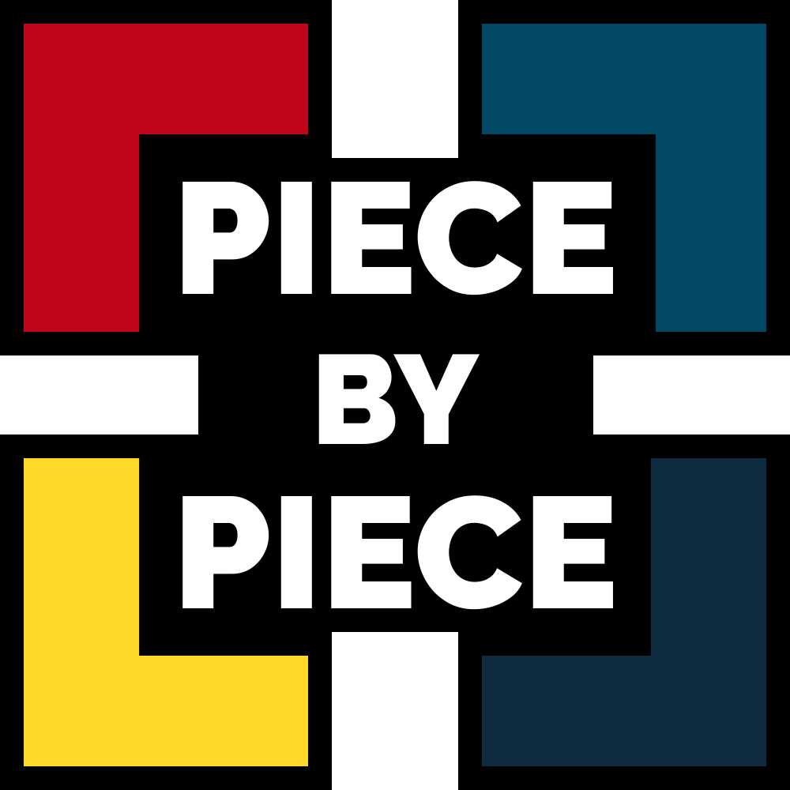
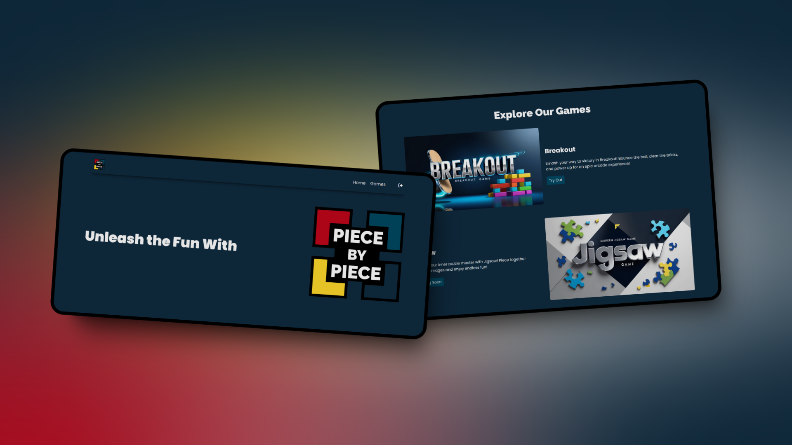

<div style="display:flex; justify-content: center;">
  
</div>

## 📂 Table of **Contents**
- [📂 Table of **Contents**](#-table-of-contents)
- [📋 Project Description](#-project-description)
- [✨ Features](#-features)
- [⛏️ Built Using](#️-built-using)
  - [Frontend](#frontend)
- [🔍 Explore The Project](#-explore-the-project)
- [📥 Installation](#-installation)
- [📝 Usage](#-usage)
- [💳 License](#-license)
- [✍ Contributors](#-contributors)
- [🏅Acknowledgments](#acknowledgments)

## 📋 Project Description
Experience the classic arcade thrill of Breakout, where you bounce a ball to shatter bricks and unleash power-ups for endless fun!

<div style="display:flex; justify-content: center;">
  
</div>

## ✨ Features
- Simple controls for moving a paddle to bounce a ball and break bricks
- User can register and login; to save his scores and display his scores on leaderborad
- Clean and visually appealing layout
- Interactive sounds
- Responsive design
- Easy navigation
- Contain 2 pages
  - Home
  - Game Stage

## ⛏️ Built Using

### Frontend
<a href="https://www.javascript.com/" target="_blank" rel="noreferrer"></a>
<a href="https://developer.mozilla.org/en-US/docs/Glossary/HTML5" target="_blank" rel="noreferrer"></a>
<a href="https://www.w3.org/TR/CSS/#css" target="_blank" rel="noreferrer"></a>


## 🔍 Explore The Project
- [Piece By Piece]([src/assets/logo/logo.svg](https://mohammed-dhabaab.github.io/piece-by-piece/))


## 📥 Installation

1. Clone the project or download the zip version of the project then unzip it
2. You need to install [node.js=18.20.2](https://nodejs.org/en/blog/release/v18.20.2), to ensure compatibility as the project built with it
3. Add node.js to environment variables (PATH)
4. Use the package manager npm to install all the dependencies specified within the package.json file using the command line within the root directory of the project:
   ```shell
   npm install
   ```

## 📝 Usage

To explore Blogmors, follow the following steps:

1. Follow [📥 Installation](#-installation) process
2. Run the development environment or build the production environment
   - To run the development environment, use the following command using the command line within the root directory of the project:
     ```shell
     npm run dev
     ```
   - To build the production environment, use the following command using the command line within the root directory of the project:
     ```shell
     npm run build
     ```

## 💳 License
- [MIT](https://choosealicense.com/licenses/mit/)

## ✍ Contributors
- Mohammed Dhabaab
  - [Website](https://mohammeddhabaab.com/)
  - [Github](https://github.com/mohammed-dhabaab)


## 🏅Acknowledgments
- [Tuwaiq Academy](https://tuwaiq.edu.sa/)
